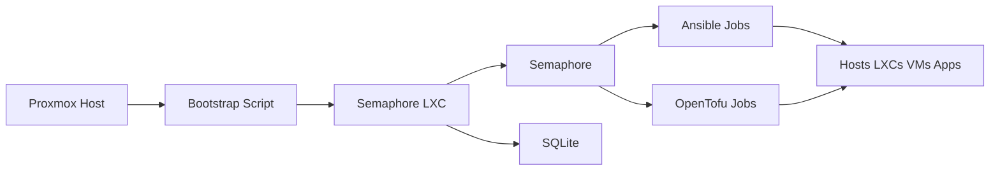

# HomeLab

This repository is the source of truth for bootstrapping, provisioning, and operating a private home lab environment built around Proxmox, OpenTofu, Ansible, and Semaphore.

The project assumes the lab is not exposed directly to the public internet. Because of that, the control plane is designed to live inside the lab itself. The first goal is to create a small, local management foundation that can bring up the rest of the environment without depending on external CI runners or public automation platforms.

## Goals

- Keep day-0 bootstrap logic in this repository and under direct review.
- Use Proxmox host-run scripts only for the minimum needed to get started.
- Use OpenTofu to manage infrastructure state and lifecycle.
- Use Ansible to configure hosts, applications, and ongoing maintenance.
- Use Semaphore as the in-lab runner, job scheduler, and operational entrypoint.
- Prefer simple, readable scripts and explicit defaults over clever abstractions.

## Operating Model

The intended workflow is:

1. Run a Proxmox host bootstrap script from this repository to create the first management LXC.
2. Install Semaphore and SQLite inside that LXC.
3. Connect Semaphore to this repository.
4. Use Semaphore to execute Ansible and OpenTofu jobs for the rest of the lab.
5. Add recurring jobs for updates, drift correction, and routine maintenance.



## Repository Layout

- [ansible/README.md](c:/Users/AlwinKruimink/source/repos/~Personal/HomeLab/ansible/README.md) contains configuration-management playbooks, inventories, roles, and maintenance automation.
- [tofu/README.md](c:/Users/AlwinKruimink/source/repos/~Personal/HomeLab/tofu/README.md) contains infrastructure definitions for Proxmox-backed resources and shared platform components.
- [scripts/README.md](c:/Users/AlwinKruimink/source/repos/~Personal/HomeLab/scripts/README.md) contains local utility and bootstrap scripts that are intended to be run manually from trusted admin locations such as a Proxmox host.
- [docs/architecture.md](c:/Users/AlwinKruimink/source/repos/~Personal/HomeLab/docs/architecture.md) describes the intended control-plane design.
- [docs/scripts.md](c:/Users/AlwinKruimink/source/repos/~Personal/HomeLab/docs/scripts.md) documents how scripts in this repository should be structured and behave.
- [docs/semaphore-bootstrap.md](c:/Users/AlwinKruimink/source/repos/~Personal/HomeLab/docs/semaphore-bootstrap.md) documents the day-0 Semaphore bootstrap flow.
- [docs/roadmap.md](c:/Users/AlwinKruimink/source/repos/~Personal/HomeLab/docs/roadmap.md) captures the phased direction for the project.

## Design Principles

- Local-first: critical automation must work even when the lab is isolated.
- Reviewable: scripts should be short, direct, and easy to audit.
- Layered: bootstrap creates the control plane, then the control plane manages everything else.
- Replaceable: bootstrap scripts are intentionally narrow and can be retired once Terraform and Ansible take over.
- Minimal trust surface: avoid remote-sourced shell logic for core provisioning.

## First Deliverable

The first concrete automation target is a Proxmox host-run script that creates an Ubuntu LXC, installs Semaphore with a SQLite database in the same container, creates the initial Linux and Semaphore access credentials, and starts the service.

That script lives at [scripts/proxmox/semaphore.sh](c:/Users/AlwinKruimink/source/repos/~Personal/HomeLab/scripts/proxmox/semaphore.sh).

## Quick Start

From a Proxmox host shell, the intended public entrypoint is:

```bash
bash -c "$(curl -fsSL https://raw.githubusercontent.com/AKruimink/HomeLab/main/scripts/proxmox/semaphore.sh)"
```

That keeps the repository easy to consume in the same style as Proxmox VE Helper Scripts while still keeping the actual script maintained here.

## Related Docs

- [docs/architecture.md](c:/Users/AlwinKruimink/source/repos/~Personal/HomeLab/docs/architecture.md)
- [docs/scripts.md](c:/Users/AlwinKruimink/source/repos/~Personal/HomeLab/docs/scripts.md)
- [docs/semaphore-bootstrap.md](c:/Users/AlwinKruimink/source/repos/~Personal/HomeLab/docs/semaphore-bootstrap.md)
- [docs/roadmap.md](c:/Users/AlwinKruimink/source/repos/~Personal/HomeLab/docs/roadmap.md)
