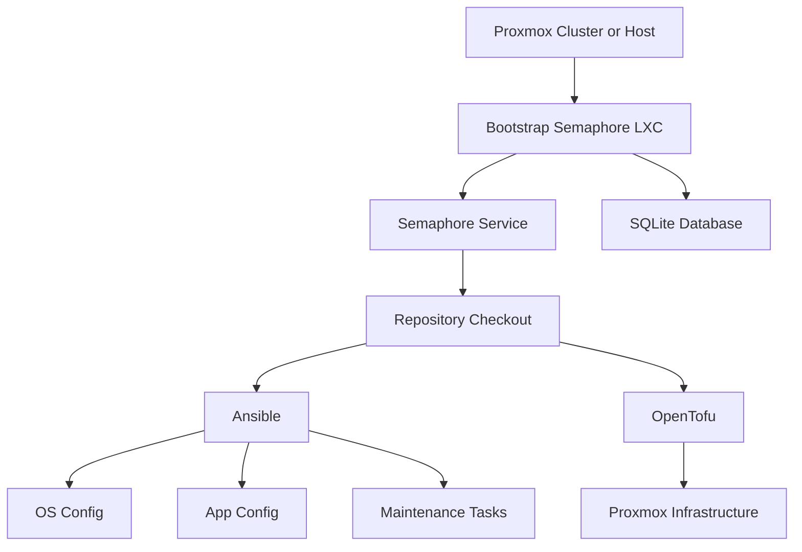

# Architecture

## Intent

This project uses a layered approach for home lab automation.

- Proxmox provides the base virtualization platform.
- A small local bootstrap script creates the first management LXC.
- Semaphore becomes the in-lab automation control plane.
- OpenTofu manages infrastructure resources.
- Ansible manages operating system, application, and maintenance configuration.

## Control Plane

Semaphore is intended to be the primary control plane once it exists.

- It runs inside the lab.
- It stores its application state in SQLite inside the same LXC for the first phase.
- It connects to this repository to load Ansible playbooks and OpenTofu code.
- It executes manual jobs and scheduled maintenance jobs.

This keeps the initial platform small and removes any requirement for a public CI runner.

## Responsibilities By Layer

### Proxmox host-run scripts

Use these only for day-0 and break-glass operations.

Examples:

- Create the first Semaphore LXC.
- Rebuild a minimal management node when nothing else exists.
- Perform narrowly scoped host-side tasks that must run before any automation platform is available.

### OpenTofu

Use OpenTofu for declarative infrastructure concerns.

Examples:

- LXC and VM definitions.
- Template-driven infrastructure layout.
- Network-adjacent definitions that belong in infrastructure state.
- Shared outputs consumed by Ansible or Semaphore.

OpenTofu should define what infrastructure exists, not how applications inside that infrastructure are configured in detail.

### Ansible

Use Ansible for configuration and day-2 operations.

Examples:

- Base OS hardening and package state.
- Application deployment and upgrades.
- Scheduled update tasks.
- Config drift correction.
- Backups, cleanup, and service restarts.

### Semaphore

Use Semaphore as the execution and scheduling layer.

Examples:

- Run OpenTofu plan and apply jobs.
- Run Ansible playbooks against specific host groups.
- Store operational variables and secrets required by jobs.
- Schedule weekly LXC updates and recurring maintenance.

## Bootstrap Sequence

1. Run the Proxmox bootstrap script from a trusted Proxmox host shell.
2. Create an Ubuntu LXC with resource and network settings chosen by default or advanced mode.
3. Install Semaphore, Ansible, and SQLite inside the LXC.
4. Create the initial Linux root password and initial Semaphore admin account.
5. Point Semaphore at this repository.
6. Start using repository-managed Ansible and OpenTofu code for everything else.

The intended public bootstrap entrypoint is [scripts/proxmox/semaphore.sh](c:/Users/AlwinKruimink/source/repos/~Personal/HomeLab/scripts/proxmox/semaphore.sh), which can be executed directly from the raw GitHub URL on a Proxmox host.

## Boundaries

- Bootstrap scripts should not become a second configuration-management system.
- Semaphore should run jobs from repository code rather than accumulating one-off inline commands.
- OpenTofu and Ansible should stay separate even when executed by the same Semaphore project.
- Secrets may start in Semaphore, but secret handling rules should remain explicit and reviewable.

## Initial Tradeoffs

- SQLite inside the Semaphore LXC is acceptable for phase one because it minimizes moving parts.
- The first management LXC is intentionally simple rather than highly available.
- The bootstrap path is optimized for clarity and recoverability, not for maximum feature depth.

If the control plane grows in importance later, the database and runner architecture can be revisited without changing the basic repository model.