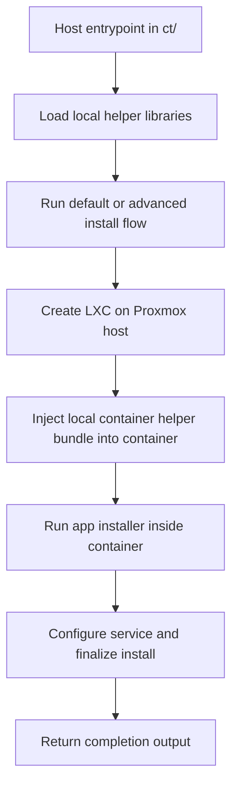
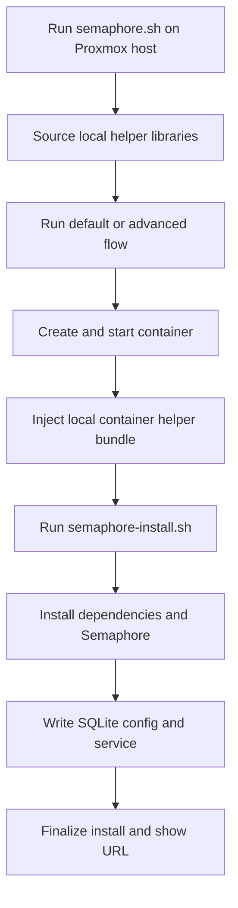

# Proxmox Script Framework

This repository now contains a local Proxmox scripting framework designed to preserve a familiar Proxmox automation workflow while keeping the code fully under your control.

## Scope

- LXC create flows
- in-container install flows
- in-container update flows
- VM create foundations with a working Ubuntu cloud-init example
- shared helper libraries for reuse across future apps

## Repository layout

- [scripts/proxmox/ct/](C:/Users/AlwinKruimink/source/repos/~Personal/HomeLab.worktrees/custom-proxmox-scripts-development/scripts/proxmox/ct)
- [scripts/proxmox/install/](C:/Users/AlwinKruimink/source/repos/~Personal/HomeLab.worktrees/custom-proxmox-scripts-development/scripts/proxmox/install)
- [scripts/proxmox/lib/](C:/Users/AlwinKruimink/source/repos/~Personal/HomeLab.worktrees/custom-proxmox-scripts-development/scripts/proxmox/lib)
- [scripts/proxmox/misc/](C:/Users/AlwinKruimink/source/repos/~Personal/HomeLab.worktrees/custom-proxmox-scripts-development/scripts/proxmox/misc)
- [scripts/proxmox/vm/](C:/Users/AlwinKruimink/source/repos/~Personal/HomeLab.worktrees/custom-proxmox-scripts-development/scripts/proxmox/vm)

## Design principles

1. Keep the host-side app entrypoint small.
2. Put repeated UX and Proxmox logic into shared libraries.
3. Push a local helper bundle into the container instead of depending on upstream helper files.
4. Keep install scripts app-focused and small.
5. Support raw GitHub execution and local checkout execution with the same files.

## Execution model



## Remote sourcing model

The entrypoints under [scripts/proxmox/ct/](C:/Users/AlwinKruimink/source/repos/~Personal/HomeLab.worktrees/custom-proxmox-scripts-development/scripts/proxmox/ct) and [scripts/proxmox/vm/](C:/Users/AlwinKruimink/source/repos/~Personal/HomeLab.worktrees/custom-proxmox-scripts-development/scripts/proxmox/vm) use this priority:

1. local files when running from a repository checkout
2. files from `HOMELAB_PROXMOX_BASE` when set
3. the default GitHub raw URL for this repository

That keeps direct `curl | bash` usage possible without giving runtime control to an external third-party project.

## Testing from a feature branch

For branch-safe remote testing, use [run.sh](C:/Users/AlwinKruimink/source/repos/~Personal/HomeLab.worktrees/custom-proxmox-scripts-development/scripts/proxmox/misc/run.sh) so the entrypoint, shared libraries, and install scripts all resolve from the same branch:

```bash
BASE=https://raw.githubusercontent.com/AKruimink/HomeLab/<your-branch>/scripts/proxmox
curl -fsSL "$BASE/misc/run.sh" | bash -s -- "$BASE" ct/semaphore.sh
```

That is the recommended branch-testing path. A plain direct `curl` of [semaphore.sh](C:/Users/AlwinKruimink/source/repos/~Personal/HomeLab.worktrees/custom-proxmox-scripts-development/scripts/proxmox/ct/semaphore.sh) is still fine for `main`, but for branches you want the explicit base so every dependent file comes from the same ref.

## Shared library responsibilities

### [common.sh](C:/Users/AlwinKruimink/source/repos/~Personal/HomeLab.worktrees/custom-proxmox-scripts-development/scripts/proxmox/lib/common.sh)

- colors and status messages
- root/Proxmox checks
- `whiptail` installation and prompts
- local/remote file bootstrap helpers

### [pve-host.sh](C:/Users/AlwinKruimink/source/repos/~Personal/HomeLab.worktrees/custom-proxmox-scripts-development/scripts/proxmox/lib/pve-host.sh)

- Proxmox storage and bridge discovery
- LXC template download/selection
- `pct` helper functions

### [lxc-build.sh](C:/Users/AlwinKruimink/source/repos/~Personal/HomeLab.worktrees/custom-proxmox-scripts-development/scripts/proxmox/lib/lxc-build.sh)

- default vs advanced LXC settings
- confirmation summary
- container creation
- host-to-container payload sync
- update execution against existing containers

### [container-install.sh](C:/Users/AlwinKruimink/source/repos/~Personal/HomeLab.worktrees/custom-proxmox-scripts-development/scripts/proxmox/lib/container-install.sh)

- container preparation
- network and OS checks
- GitHub release download helpers
- MOTD/update wrapper creation
- cleanup

### [vm-build.sh](C:/Users/AlwinKruimink/source/repos/~Personal/HomeLab.worktrees/custom-proxmox-scripts-development/scripts/proxmox/lib/vm-build.sh)

- VM defaults and advanced settings
- Ubuntu cloud image bootstrap
- cloud-init VM creation helpers

## Semaphore implementation

The first complete app implementation is:

- host entrypoint: [semaphore.sh](C:/Users/AlwinKruimink/source/repos/~Personal/HomeLab.worktrees/custom-proxmox-scripts-development/scripts/proxmox/ct/semaphore.sh)
- in-container installer: [semaphore-install.sh](C:/Users/AlwinKruimink/source/repos/~Personal/HomeLab.worktrees/custom-proxmox-scripts-development/scripts/proxmox/install/semaphore-install.sh)

It currently provides:

- default and advanced LXC create flows
- Semaphore installer behavior using SQLite
- original HomeLab shared helper flow
- branch-safe remote execution through [run.sh](C:/Users/AlwinKruimink/source/repos/~Personal/HomeLab.worktrees/custom-proxmox-scripts-development/scripts/proxmox/misc/run.sh)

## LXC create/install flow



## VM example

The first VM-oriented entrypoint is:

- [ubuntu-2404-cloudinit.sh](C:/Users/AlwinKruimink/source/repos/~Personal/HomeLab.worktrees/custom-proxmox-scripts-development/scripts/proxmox/vm/ubuntu-2404-cloudinit.sh)

It creates a reusable Ubuntu 24.04 cloud-init VM with the same default/advanced UX style as the LXC side.

## Extending the framework

To add another LXC app later:

1. copy the structure of [semaphore.sh](C:/Users/AlwinKruimink/source/repos/~Personal/HomeLab.worktrees/custom-proxmox-scripts-development/scripts/proxmox/ct/semaphore.sh)
2. add a matching installer beside [semaphore-install.sh](C:/Users/AlwinKruimink/source/repos/~Personal/HomeLab.worktrees/custom-proxmox-scripts-development/scripts/proxmox/install/semaphore-install.sh)
3. reuse the helper bundle from [lib/](C:/Users/AlwinKruimink/source/repos/~Personal/HomeLab.worktrees/custom-proxmox-scripts-development/scripts/proxmox/lib)
4. keep app-specific logic inside the install script and shared flow logic in the libraries
