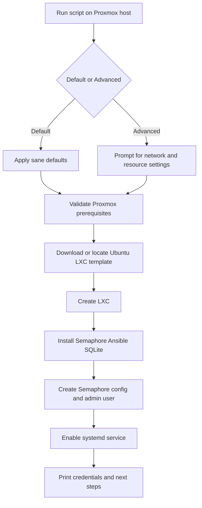

# Semaphore Bootstrap

## Purpose

This document describes the first day-0 bootstrap target for the repository: a single Proxmox LXC that runs Semaphore and SQLite together.

## Bootstrap Target

The first bootstrap target is a single LXC containing:

- Ubuntu 24.04 LTS
- Semaphore
- SQLite
- Ansible

This gives the lab a local runner that can immediately pull this repository and begin managing the rest of the environment.

## Public Entrypoint

The intended public entrypoint is:

```bash
bash -c "$(curl -fsSL https://raw.githubusercontent.com/AKruimink/HomeLab/main/scripts/proxmox/semaphore.sh)"
```

The script itself lives at [scripts/proxmox/semaphore.sh](c:/Users/AlwinKruimink/source/repos/~Personal/HomeLab/scripts/proxmox/semaphore.sh).

The shared dialog and helper logic for Proxmox-facing scripts lives under [scripts/shared/proxmox-ui.sh](c:/Users/AlwinKruimink/source/repos/~Personal/HomeLab/scripts/shared/proxmox-ui.sh).

## Reference Pattern

The intended operator experience is inspired by Proxmox VE Helper Scripts:

- run from the Proxmox host shell
- accept safe defaults for a quick path
- optionally choose advanced settings for storage, networking, and resources
- finish with a working container, credentials, and next steps

## Default And Advanced Modes

### Default mode

Default mode should choose sane values and ask only for the minimum needed to produce a working Semaphore installation.

Expected defaults:

- next available container ID
- hostname based on a project default
- bridge `vmbr0`
- DHCP networking
- unprivileged container
- Ubuntu 24.04 template, resolved dynamically to the latest matching build available on the Proxmox host
- sensible CPU, RAM, swap, and disk defaults

### Advanced mode

Advanced mode should allow control over:

- container ID
- hostname
- CPU cores
- RAM
- swap
- disk size
- bridge
- VLAN tag
- DHCP versus static addressing
- gateway when using static addressing
- privileged versus unprivileged mode
- whether the container starts on boot

## Bootstrap Flow



## After Bootstrap

Once Semaphore is up:

1. Create or import a Semaphore project that points to this repository.
2. Add repository-backed task templates for Ansible and OpenTofu.
3. Store required variables and secrets in Semaphore.
4. Move repeatable operations out of host-run scripts and into repository-managed jobs.

## Future Expansion

Over time, more Proxmox host entrypoints may be added, but this one remains the first and most important bootstrap path because it creates the control plane that runs everything else.